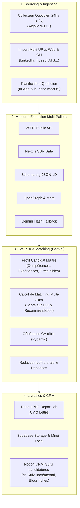

# ⚡ Trema Job Search

> **Agent IA Personnel de Recherche d'Emploi & Préparation de Candidatures sur Mesure**  
> *"L'IA analyse, adapte le CV et rédige les lettres de motivation ; vous validez et postulez."*

---

## 📌 Présentation

**Trema Job Search** est un agent IA autonome conçu pour transformer le processus de recherche d'emploi :
- **Veille automatisée** : Collecte quotidienne des nouvelles offres ciblées (Welcome to the Jungle, LinkedIn, Indeed, Apec, France Travail, sites carrières).
- **Matching IA multicritères** : Évaluation en temps réel de l'adéquation entre l'offre et votre profil candidat maître (compétences techniques, séniorité, contrat, localisation).
- **Génération automatique des livrables** : Pour chaque offre qualifiée ($\ge 75/100$) :
  - **CV sur mesure (PDF ReportLab)** respectant strictement votre parcours réel (zéro hallucination).
  - **Lettre de motivation personnalisée** au ton oral naturel (structure en 6 points sans formules pompeuses).
  - **Réponses préparées** aux questions fréquentes d'entretien et formulaires de candidature.
- **Synchronisation CRM Notion** : Création automatique d'une fiche complète dans votre base Notion « 💼 Suivi candidatures » avec numéro de suivi séquentiel incrémental (`N suivi`), analyse de matching, boutons de téléchargement et lien vers le CV généré.
- **Double sauvegarde** : Téléversement sur Supabase Storage et miroir local sur votre machine.

---

## 🛠️ Architecture Technique



- **Monorepo** : pnpm workspaces + Turborepo — `apps/api` (Python), `apps/web` (Next.js), `packages/api-client` (SDK TypeScript généré).
- **Backend** : Python 3.11+, FastAPI + Uvicorn, Pydantic v2, schéma OpenAPI natif (`/docs`, `/openapi.json`).
- **Frontend** : Next.js 15 (App Router), TypeScript strict, Tailwind CSS, TanStack Query, Recharts ; types générés depuis l'OpenAPI (`openapi-typescript` + `openapi-fetch`).
- **Modèles d'IA** : Google Gemini 3.5 Flash / Flash Lite avec cascade automatique multi-modèles anti-quota.
- **Base de données & Storage** : Supabase (PostgreSQL & Storage S3).
- **CRM Candidatures** : Notion API (Official Client).
- **Moteur PDF** : ReportLab.
- **Conteneurisation** : Docker & Docker Compose.

---

## 🚀 Démarrage Rapide avec Docker (Recommandé)

### 1. Prérequis
- [Docker](https://docs.docker.com/get-docker/) et Docker Compose installés.
- Clés d'API requises : **Google Gemini**, **Supabase** et **Notion**.

### 2. Configuration
Créez votre fichier d'environnement `.env` à partir du modèle :
```bash
cp .env.example .env
```
Renseignez vos clés dans `.env` :
```env
# Supabase
SUPABASE_URL=https://votre-projet.supabase.co
SUPABASE_KEY=votre-cle-api

# Gemini
GEMINI_API_KEY=votre-cle-gemini

# Notion
NOTION_TOKEN=ntn_votre-token-notion
NOTION_DATABASE_ID=votre-database-id-32-caracteres

# Sur un VPS : URL publique de l'API (vue depuis le navigateur) et origine du frontend
NEXT_PUBLIC_API_URL=https://api.mon-domaine.fr
CORS_ORIGINS=https://jobs.mon-domaine.fr
```

### 3. Lancer l'application
```bash
docker compose up -d --build
```
Deux services démarrent :
- **Frontend Next.js** : [http://localhost:3000](http://localhost:3000)
- **API FastAPI** : [http://localhost:8000](http://localhost:8000) — documentation interactive sur [http://localhost:8000/docs](http://localhost:8000/docs)

Le navigateur appelle l'API directement à l'adresse `NEXT_PUBLIC_API_URL` (figée au build de l'image web) : changez-la puis reconstruisez (`docker compose build web`) pour un autre domaine.

Volumes persistants : `./candidatures` (PDFs générés), `./apps/api/prompts` (prompts modifiables à chaud, lecture seule), `./apps/api/instance` (état du planificateur) et `./apps/api/logs`.

### 4. Commandes utiles Docker
```bash
# Voir les logs en direct
docker compose logs -f

# Arrêter les conteneurs
docker compose down

# Lancer la collecte quotidienne manuellement dans le conteneur API
docker compose run --rm api python run.py cron-job

# Importer un lot d'URLs via la CLI
docker compose run --rm api python run.py urls "https://www.linkedin.com/jobs/view/123456/" "https://www.welcometothejungle.com/fr/companies/corp/jobs/dev"
```

---

## 💻 Démarrage Local (Sans Docker)

Prérequis : [uv](https://docs.astral.sh/uv/) (Python) et [pnpm](https://pnpm.io/) (Node 22).

```bash
# 1. Dépendances JS/TS du monorepo
pnpm install

# 2. Dépendances Python de l'API
uv sync --directory apps/api

# 3. Lancer l'API (http://localhost:8000) et le frontend (http://localhost:3000)
uv run --directory apps/api python run.py serve --reload
pnpm --filter web dev
```

Après tout changement des schémas ou routes de l'API, régénérez le SDK TypeScript :
```bash
pnpm generate:api-client
```
Un test de contrat (`apps/api/tests/test_openapi_contract.py`) échoue si `packages/api-client/openapi.json` n'est plus à jour.

---

## 🌟 Fonctionnalités Détaillées

### 1. 🕒 Planificateur Quotidien Automatique
- **Tourne chaque matin à 08h00** (modifiable à chaud depuis le Dashboard).
- Détecte toutes les offres CDI publiées dans les dernières 24h correspondant à votre profil maître.
- Évalue chaque offre, génère les dossiers pour les scores $\ge 75/100$, et synchronise Notion avant votre réveil.
- **Double mécanisme** :
  - *In-App* : Thread non-bloquant intégré à l'API FastAPI (pilotable depuis le dashboard et la page Paramètres).
  - *Système macOS* : Déclenchement automatique via LaunchAgent (`launchd`) même si le navigateur est fermé (`./scripts/setup_cron.sh`).

### 2. 📥 Import d'Offres Externes (Unitaire & Lot d'URLs)
- Bouton **`📥 Importer par URL`** disponible sur le Dashboard et la page Offres.
- **Support multi-URLs** : Collez une ou 20 URLs d'un coup (une par ligne ou séparées par des virgules).
- **Moteur multi-sources** :
  - LinkedIn (nettoyage automatique des trackers `utm_*`, `refId`).
  - Welcome to the Jungle (API et SSR).
  - Indeed, Apec, France Travail.
  - Sites carrières et ATS d'entreprises (Workday, Greenhouse, Lever, etc.).
- **Résilience** : En cas d'offre expirée ou 404 dans un lot, l'erreur est consignée et le reste du lot continue.
- **Rapport de synthèse immédiat** : Badges de score, boutons directs vers les fiches Notion créées et téléchargement des PDFs.

### 3. 📄 Dossier de Candidature Haute Fidélité
Pour toute offre qualifiée :
- **Nommage standardisé** : `Emmanuel_TRO_CV_{Entreprise}_{Poste}.pdf` (caractères ASCII sécurisés).
- **CV ReportLab 1 page** : Structure éditoriale moderne, mise en valeur des compétences clés demandées, respect absolu de la véracité de votre parcours.
- **Lettre de motivation orale (6 points)** : Ton direct et professionnel, personnalisé aux enjeux de l'entreprise.
- **Réponses formulaires** : Disponibilité, mobilité nationale, prétentions salariales indicatives (avec mention `[À VALIDER]`).

### 4. 💼 CRM Notion « Suivi candidatures »
Chaque candidature préparée crée une page enrichie dans Notion :
- **Propriétés renseignées** : `N suivi` incrémental automatique (ex: 165, 166, 167...), `Entreprise`, `Poste`, `Statut` (*Candidature prête - en attente de validation*), `Lieu`, `Type`, `Domaine`, `Score IA`, `Lien de l'offre`.
- **Propriété `CV utilisé`** : Lien cliquable formaté vers le PDF stocké sur Supabase.
- **Corps de page riche** : Callout de score, statut administratif (Master MIAGE Rennes), mobilité France entière, lettre complète et boutons d'accès rapide.

---

## ⌨️ Commandes en Ligne de Commande (CLI)

`apps/api/run.py` pilote l'API et les tâches batch (à lancer depuis `apps/api`, ou via `uv run --directory apps/api`) :

```bash
# Démarrer l'API (uvicorn), avec rechargement à chaud en développement
uv run python run.py serve --reload

# 1. Collecte des offres des dernières 24h (ou 3j, 7j)
uv run python run.py collect 24h --limit 5

# 2. Exécution pour tâche planifiée / cron (durée=24h, limite=10, auto-prep=True, puis réconciliation Notion)
uv run python run.py cron-job

# 3. Importer une ou plusieurs offres par URL
uv run python run.py urls "https://www.linkedin.com/jobs/view/4165261775/" "https://..."

# 4. Importer depuis un fichier texte d'URLs (une par ligne)
uv run python run.py urls --file liens_offres.txt

# 5. Analyser sans générer automatiquement les documents PDF ni Notion
uv run python run.py urls "https://..." --no-prepare

# 6. Réconciliation bidirectionnelle Notion ↔ Supabase
uv run python run.py sync-notion
```

Le planificateur macOS (`apps/api/scripts/setup_cron.sh`) installe un LaunchAgent qui exécute `run.py cron-job` chaque matin.

---

## 🧪 Tests Automatisés

```bash
# API : 122 tests pytest (routes v1 avec base en mémoire, scraping, matching, PDF, Notion, planificateur, contrat OpenAPI)
pnpm test:api

# Frontend & SDK : typage strict de bout en bout (dont des tests de types compilés dans packages/api-client)
pnpm typecheck
```

---

## 📁 Structure du Projet

```text
trema-job-search/
├── apps/
│   ├── api/                       # Backend Python (FastAPI)
│   │   ├── app/
│   │   │   ├── api/v1/            # Routers FastAPI (jobs, applications, candidate, scheduler, analytics, settings)
│   │   │   ├── schemas/           # Modèles Pydantic v2 (api.py = contrats HTTP, source de l'OpenAPI)
│   │   │   ├── llm/               # Routeur LLM multi-fournisseurs (Gemini, Groq, Mistral, OpenRouter) et cache
│   │   │   └── services/          # Métier : ai/, documents/ (ReportLab), ingestion/, notion/, scheduler/, storage/
│   │   ├── prompts/               # Prompts système Markdown modifiables à chaud
│   │   ├── scripts/               # export_openapi.py, LaunchAgent macOS, utilitaires de prévisualisation
│   │   ├── tests/                 # Suite pytest (TestClient FastAPI + faux Supabase en mémoire)
│   │   ├── main.py                # Application ASGI (CORS, logging, gestion d'erreurs, OpenAPI enrichi)
│   │   ├── run.py                 # CLI : serve / collect / urls / sync-notion / cron-job
│   │   ├── Dockerfile
│   │   └── pyproject.toml         # Dépendances gérées par uv
│   └── web/                       # Frontend Next.js 15 (App Router)
│       ├── src/app/               # Pages : dashboard, jobs, jobs/[id], jobs/import, applications, applications/[id], candidate, settings, analytics
│       ├── src/components/        # UI (style shadcn), composants par domaine
│       ├── src/hooks/             # TanStack Query : requêtes, mutations, flux SSE
│       ├── src/lib/               # Client API, formatage, statuts, palette de visualisation
│       └── Dockerfile
├── packages/
│   └── api-client/                # SDK TypeScript généré depuis l'OpenAPI (types + client openapi-fetch + helper SSE)
├── candidatures/                  # Miroir local persistant des PDFs générés
├── migrations/                    # Scripts de migration SQL Supabase
├── docker-compose.yml             # Orchestration api (:8000) + web (:3000)
├── turbo.json                     # Pipeline Turborepo (build, dev, lint, typecheck, generate:api-client)
└── package.json                   # Workspaces pnpm et scripts racine
```

---

## 🔒 Sécurité & Confidentialité

- **Zéro hallucination** : L'IA ne peut générer de qualifications ou d'expériences absentes du profil candidat maître.
- **Contrôle humain strict** : L'agent ne procède **jamais** à la soumission finale des candidatures sur les formulaires sans votre validation manuelle.
- **Variables sensibles** : Aucune clé d'API n'est intégrée dans les images Docker (`.dockerignore` protège les secrets).
