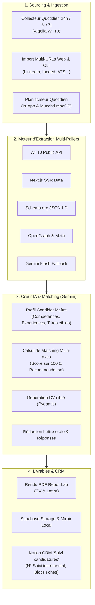

# ⚡ Trema Job Search

> **Agent IA Personnel de Recherche d'Emploi & Préparation de Candidatures sur Mesure**  
> *"L'IA analyse, adapte le CV et rédige les lettres de motivation ; vous validez et postulez."*

---

## 📌 Présentation

**Trema Job Search** est un agent IA autonome conçu pour transformer le processus de recherche d'emploi :
- **Veille automatisée** : Collecte quotidienne des nouvelles offres ciblées (Welcome to the Jungle, LinkedIn, Indeed, Apec, France Travail, sites carrières).
- **Matching IA multicritères** : Évaluation en temps réel de l'adéquation entre l'offre et votre profil candidat maître (compétences techniques, séniorité, contrat, localisation).
- **Génération automatique des livrables** : Pour chaque offre qualifiée ($\ge 75/100$) :
  - **CV sur mesure (PDF ReportLab)** respectant strictement votre parcours réel (zéro hallucination).
  - **Lettre de motivation personnalisée** au ton oral naturel (structure en 6 points sans formules pompeuses).
  - **Réponses préparées** aux questions fréquentes d'entretien et formulaires de candidature.
- **Synchronisation CRM Notion** : Création automatique d'une fiche complète dans votre base Notion « 💼 Suivi candidatures » avec numéro de suivi séquentiel incrémental (`N suivi`), analyse de matching, boutons de téléchargement et lien vers le CV généré.
- **Double sauvegarde** : Téléversement sur Supabase Storage et miroir local sur votre machine.

---

## 🛠️ Architecture Technique



- **Backend** : Python 3.11+, Flask (Architecture Factory, Blueprints).
- **Modèles d'IA** : Google Gemini 3.5 Flash / Flash Lite avec cascade automatique multi-modèles anti-quota.
- **Base de données & Storage** : Supabase (PostgreSQL & Storage S3).
- **CRM Candidatures** : Notion API (Official Client).
- **Moteur PDF** : ReportLab.
- **Conteneurisation** : Docker & Docker Compose.

---

## 🚀 Démarrage Rapide avec Docker (Recommandé)

### 1. Prérequis
- [Docker](https://docs.docker.com/get-docker/) et Docker Compose installés.
- Clés d'API requises : **Google Gemini**, **Supabase** et **Notion**.

### 2. Configuration
Créez votre fichier d'environnement `.env` à partir du modèle :
```bash
cp .env.example .env
```
Renseignez vos clés dans `.env` :
```env
# Supabase
SUPABASE_URL=https://votre-projet.supabase.co
SUPABASE_KEY=votre-cle-api

# Gemini
GEMINI_API_KEY=votre-cle-gemini

# Notion
NOTION_TOKEN=ntn_votre-token-notion
NOTION_DATABASE_ID=votre-database-id-32-caracteres
```

### 3. Lancer l'application
```bash
docker compose up -d --build
```
L'application est immédiatement accessible sur : **[http://localhost:5001](http://localhost:5001)**.

### 4. Commandes utiles Docker
```bash
# Voir les logs en direct
docker compose logs -f

# Arrêter les conteneurs
docker compose down

# Lancer la collecte quotidienne manuellement dans Docker
docker compose run --rm web python run.py --cron-job

# Importer un lot d'URLs via la CLI Docker
docker compose run --rm web python run.py --urls "https://www.linkedin.com/jobs/view/123456/" "https://www.welcometothejungle.com/fr/companies/corp/jobs/dev"
```

---

## 💻 Démarrage Local (Sans Docker)

```bash
# 1. Créer l'environnement virtuel
python3 -m venv .venv
source .venv/bin/activate

# 2. Installer les dépendances
pip install -r requirements.txt

# 3. Lancer le serveur web
python run.py
```
Le serveur démarrera sur `http://127.0.0.1:5001`.

---

## 🌟 Fonctionnalités Détaillées

### 1. 🕒 Planificateur Quotidien Automatique
- **Tourne chaque matin à 08h00** (modifiable à chaud depuis le Dashboard).
- Détecte toutes les offres CDI publiées dans les dernières 24h correspondant à votre profil maître.
- Évalue chaque offre, génère les dossiers pour les scores $\ge 75/100$, et synchronise Notion avant votre réveil.
- **Double mécanisme** :
  - *In-App* : Thread non-bloquant intégré au serveur Flask.
  - *Système macOS* : Déclenchement automatique via LaunchAgent (`launchd`) même si le navigateur est fermé (`./scripts/setup_cron.sh`).

### 2. 📥 Import d'Offres Externes (Unitaire & Lot d'URLs)
- Bouton **`📥 Importer par URL`** disponible sur le Dashboard et la page Offres.
- **Support multi-URLs** : Collez une ou 20 URLs d'un coup (une par ligne ou séparées par des virgules).
- **Moteur multi-sources** :
  - LinkedIn (nettoyage automatique des trackers `utm_*`, `refId`).
  - Welcome to the Jungle (API et SSR).
  - Indeed, Apec, France Travail.
  - Sites carrières et ATS d'entreprises (Workday, Greenhouse, Lever, etc.).
- **Résilience** : En cas d'offre expirée ou 404 dans un lot, l'erreur est consignée et le reste du lot continue.
- **Rapport de synthèse immédiat** : Badges de score, boutons directs vers les fiches Notion créées et téléchargement des PDFs.

### 3. 📄 Dossier de Candidature Haute Fidélité
Pour toute offre qualifiée :
- **Nommage standardisé** : `Emmanuel_TRO_CV_{Entreprise}_{Poste}.pdf` (caractères ASCII sécurisés).
- **CV ReportLab 1 page** : Structure éditoriale moderne, mise en valeur des compétences clés demandées, respect absolu de la véracité de votre parcours.
- **Lettre de motivation orale (6 points)** : Ton direct et professionnel, personnalisé aux enjeux de l'entreprise.
- **Réponses formulaires** : Disponibilité, mobilité nationale, prétentions salariales indicatives (avec mention `[À VALIDER]`).

### 4. 💼 CRM Notion « Suivi candidatures »
Chaque candidature préparée crée une page enrichie dans Notion :
- **Propriétés renseignées** : `N suivi` incrémental automatique (ex: 165, 166, 167...), `Entreprise`, `Poste`, `Statut` (*Candidature prête - en attente de validation*), `Lieu`, `Type`, `Domaine`, `Score IA`, `Lien de l'offre`.
- **Propriété `CV utilisé`** : Lien cliquable formaté vers le PDF stocké sur Supabase.
- **Corps de page riche** : Callout de score, statut administratif (Master MIAGE Rennes), mobilité France entière, lettre complète et boutons d'accès rapide.

---

## ⌨️ Commandes en Ligne de Commande (CLI)

Le fichier `run.py` offre une interface CLI puissante :

```bash
# 1. Collecte des offres des dernières 24h (ou 3j, 7j)
python run.py --collect 24h --limit 5

# 2. Exécution pour tâche planifiée / cron (durée=24h, auto-prep=True)
python run.py --cron-job

# 3. Importer une offre spécifique par URL
python run.py --url "https://www.linkedin.com/jobs/view/4165261775/"

# 4. Importer plusieurs offres d'un coup
python run.py --urls "url1" "url2" "url3"

# 5. Importer depuis un fichier texte d'URLs (une par ligne)
python run.py --urls-file liens_offres.txt

# 6. Analyser sans générer automatiquement les documents PDF ni Notion
python run.py --url "https://..." --no-prepare
```

---

## 🧪 Tests Automatisés

Le projet inclut une suite complète de **27 tests automatisés** testant chaque composant (routes HTTP, scraping, parsing, matching, génération ReportLab, synchronisation Notion, planificateur, import par lot).

```bash
# Exécuter l'ensemble des tests
pytest

# Exécuter avec rapport détaillé
pytest -v
```

---

## 📁 Structure du Projet

```text
trema-job-search/
├── app/
│   ├── routes/              # Contrôleurs HTTP Flask (dashboard, jobs, applications, scheduler)
│   ├── schemas/             # Modèles de données Pydantic (candidate, job, match, application)
│   ├── services/
│   │   ├── ai/              # Connecteur Gemini, cascade anti-quota, générateurs CV/LM/Réponses
│   │   ├── documents/       # Moteur PDF ReportLab & renderer de stockage dual
│   │   ├── ingestion/       # Collecteur Algolia, scraper multi-sources, importeur, déduplicateur
│   │   ├── notion/          # Client Notion API (création fiches, N° suivi, blocs riches)
│   │   ├── scheduler/       # Planificateur automatique quotidien (in-app threading)
│   │   └── storage/         # Connecteur Supabase (PostgreSQL & Storage S3)
│   ├── static/              # Fichiers CSS et assets
│   └── templates/           # Vues Jinja2 (Dashboard, Offres, Candidatures, Modales interactives)
├── instance/                # Données persistantes locales (scheduler_status.json)
├── migrations/              # Scripts de migration SQL
├── prompts/                 # Templates de prompts Markdown modifiables à chaud
├── scripts/                 # Scripts d'automatisation (LaunchAgent macOS, setup_cron.sh)
├── tests/                   # Suite de tests automatisés pytest (27 tests)
├── Dockerfile               # Image Docker multi-plateforme
├── docker-compose.yml       # Déploiement conteneurisé
├── pyproject.toml           # Métadonnées et dépendances du projet
├── requirements.txt         # Dépendances Python pip
├── run.py                   # Point d'entrée Web et CLI
└── README.md                # Documentation du projet
```

---

## 🔒 Sécurité & Confidentialité

- **Zéro hallucination** : L'IA ne peut générer de qualifications ou d'expériences absentes du profil candidat maître.
- **Contrôle humain strict** : L'agent ne procède **jamais** à la soumission finale des candidatures sur les formulaires sans votre validation manuelle.
- **Variables sensibles** : Aucune clé d'API n'est intégrée dans les images Docker (`.dockerignore` protège les secrets).
