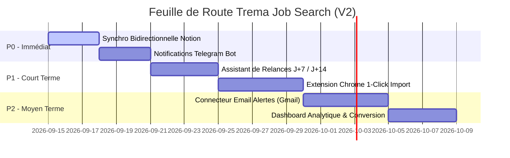

# 🗺️ Spécification des Évolutions Futures — Ce qu'il reste à faire (Roadmap V2)

> **Document de référence pour le développement futur de Trema Job Search**  
> *Dernière mise à jour : Septembre 2026*  
> *Statut : En cours de planification & d'ordonnancement*

---

## 📊 1. État des Lieux & Bilan de l'Existant (Socle V1 Validé)

Avant de détailler les chantiers restants, voici le périmètre d'ores et déjà **intégralement implémenté, testé (29/29 tests passants) et déployé sous Docker** :

| Domaine | Fonctionnalité | Statut | Détails |
| :--- | :--- | :---: | :--- |
| **Profil Maître** | Gestion du profil candidat maître (Emmanuel TRO, MIAGE) | ✅ Fait | Compétences hiérarchisées, filtres stricts (CDI, mobilité France entière, 42k€-46k€). |
| **Ingestion Quotidienne** | Collecte automatique 24h / 3j / 7j | ✅ Fait | Connexion Algolia WTTJ, filtrage direct des publications récentes. |
| **Planificateur** | Automatisation matinale à 08h00 | ✅ Fait | Double couche : thread in-app non-bloquant + LaunchAgent macOS (`launchd`). |
| **Import Multi-URLs** | Scraping unitaire et par lot d'offres externes | ✅ Fait | Cascade 5 paliers (WTTJ, Next.js, JSON-LD, Meta, Gemini), résilience, Web UI & CLI. |
| **Matching IA** | Évaluation multicritères (compétences, séniorité, contrat) | ✅ Fait | Modèles Gemini Flash avec cascade anti-quota automatique et verdict structuré. |
| **Dossier de Candidature** | Génération automatique des livrables ($\ge 75/100$) | ✅ Fait | CV PDF ReportLab (1 page), lettre de motivation orale (6 points), réponses d'entretien. |
| **Stockage Dual** | Archivage des PDFs | ✅ Fait | Supabase Storage S3 + miroir local structuré (`/CANDIDATURES/{Entreprise}/CV/`). |
| **CRM Notion** | Synchronisation automatique base « 💼 Suivi candidatures » | ✅ Fait | Incrémentation séquentielle du `N suivi`, callouts d'adéquation, statut MIAGE, boutons directs. |
| **Conteneurisation** | Docker & Compose | ✅ Fait | `Dockerfile` slim, `docker-compose.yml`, volumes de persistance, healthcheck, `README.md`. |

---

## 🎯 2. Matrice de Priorisation des Fonctionnalités Restantes

| Chantier | Description | Priorité | Impact | Effort |
| :--- | :--- | :---: | :---: | :---: |
| **Chantier 1** | Synchronisation Bidirectionnelle Notion ↔ Supabase | **P0 (Immédiat)** | 🔥 Élevé | Faible |
| **Chantier 2** | Notifications Proactives (Telegram / WhatsApp / Email) | **P0 (Immédiat)** | 🔥 Élevé | Faible |
| **Chantier 3** | Assistant de Relances & Suivi d'Entretiens | **P1 (Court terme)** | ⚡ Moyen | Faible |
| **Chantier 4** | Extension Navigateur Chrome (Import 1-Click) | **P1 (Court terme)** | 🔥 Élevé | Moyen |
| **Chantier 5** | Ingestion par Boîte Mail (Alertes LinkedIn / Indeed) | **P2 (Moyen terme)**| ⚡ Moyen | Moyen |
| **Chantier 6** | Dashboard Analytique & Taux de Conversion | **P2 (Moyen terme)**| 💡 Valeur | Moyen |
| **Chantier 7** | A/B Testing de CV & Multi-Profils Maîtres | **P3 (Futur)** | 💡 Valeur | Moyen |

---

## 🚀 3. Détail des Chantiers & Spécifications Techniques

---

### 🟢 Chantier 1 : Synchronisation Bidirectionnelle Notion ↔ Supabase (P0)

#### Contexte & Problème actuel
Actuellement, le flux va de **Trema Job Search vers Notion**. Dès qu'une offre est préparée, la fiche Notion est créée avec le statut `Candidature prête - en attente de validation`.  
Lorsque le candidat consulte sa base Notion et passe le statut à `Candidature envoyée`, `Entretien RH`, `Entretien Technique`, ou `Refusée`, Supabase n'est pas encore informé de cette mise à jour.

#### Objectifs
1. Permettre la réconciliation automatique des statuts Notion vers Supabase.
2. Enregistrer la date réelle d'envoi (`applied_at`) lorsque le statut passe à `Candidature envoyée`.
3. Assurer une cohérence parfaite entre l'interface Web locale et le tableau Notion.

#### Architecture Technique
- **Mode 1 : Polling périodique léger** :
  - Une tâche de fond (ou bouton sur le Dashboard) interroge l'API Notion (`databases.query`) avec filtre sur `last_edited_time > dernière_synchro`.
  - Détection des pages dont le statut a changé.
- **Mode 2 : Webhook Notion (Optionnel)** :
  - Endpoint `POST /api/webhooks/notion` sécurisé par signature.

#### Mapping des statuts Notion ↔ Supabase
| Statut Notion | Statut Supabase | Action déclenchée |
| :--- | :--- | :--- |
| `Candidature prête - en attente de validation` | `PREPARED` | Dossier prêt, en attente de soumission. |
| `Candidature envoyée` | `APPLIED` | Fixe automatiquement `applied_at = now()`. |
| `Entretien RH programmé` | `INTERVIEW_HR` | Planifie un rappel de préparation d'entretien. |
| `Entretien Technique programmé` | `INTERVIEW_TECH` | Génère la fiche mémo technique. |
| `Offre reçue` | `OFFER` | Clôture positive. |
| `Refusée / Sans suite` | `REJECTED` | Archivage et analyse des motifs si présents. |

---

### 🟢 Chantier 2 : Notifications Proactives (Telegram / WhatsApp / Email) (P0)

#### Contexte & Problème actuel
Le planificateur automatique s'exécute chaque matin à 08h00, prépare les candidatures et synchronise Notion. Cependant, le candidat doit ouvrir Notion ou son navigateur pour savoir si de nouvelles offres ont été trouvées.

#### Objectifs
Envoyer chaque matin (ou instantanément lors d'un match exceptionnel) un récapitulatif synthétique sur son téléphone :
- **Canal recommandé** : **Telegram Bot** (gratuit, rapide, interactif, sans abonnement Twilio) ou Email SMTP.
- **Contenu du message matinal (08h05)** :
  ```text
  ☕ Bonjour Emmanuel ! Voici votre point candidatures du matin :
  
  🎯 3 nouvelles offres qualifiées prêtes à postuler :
  1. Développeur Go / Cloud — Qonto (Score : 91/100)
     👉 Fiche Notion #166 : https://app.notion.com/p/...
  2. Ingénieur Backend Java — PayFit (Score : 88/100)
     👉 Fiche Notion #167 : https://app.notion.com/p/...
  3. Tech Lead Backend — Doctolib (Score : 84/100)
     👉 Fiche Notion #168 : https://app.notion.com/p/...
  
  📄 CVs ReportLab et lettres de motivation orales déjà générés.
  Bonne journée !
  ```

#### Livrables techniques
1. Module `app/services/notifications/telegram.py` (ou `notification_service.py`).
2. Configuration des variables d'environnement : `TELEGRAM_BOT_TOKEN`, `TELEGRAM_CHAT_ID`.
3. Déclenchement automatique en fin d'exécution du planificateur quotidien dans `daily_scheduler.py`.

---

### 🟡 Chantier 3 : Assistant de Relances & Suivi d'Entretiens (P1)

#### Contexte & Problème actuel
Après avoir postulé, beaucoup de candidatures restent sans réponse. Savoir quand et comment relancer de façon professionnelle sans être insistant est chronophage.

#### Objectifs
1. **Détection automatique des candidatures à relancer** :
   - Règle J+7 : Première relance courtoise.
   - Règle J+14 : Deuxième relance définitive.
2. **Génération du message de relance sur mesure** :
   - Basé sur le poste ciblé, l'entreprise, et les arguments clés mis en avant dans la lettre initiale.
   - Ton direct, professionnel et respectueux.
   - Ajout d'un bouton dans Notion CRM : `Copier le message de relance J+7`.
3. **Fiche Mémo "Préparation d'Entretien"** :
   - Dès qu'une candidature passe au statut `Entretien`, l'IA génère une fiche mémo (Markdown / PDF / Notion) :
     - Synthèse de l'entreprise et de son modèle économique.
     - Stack technique détaillée et questions probables sur leur architecture.
     - Questions intelligentes et pertinentes que le candidat peut poser à la fin de l'entretien.

---

### 🟡 Chantier 4 : Extension Navigateur Chrome "1-Click Import" (P1)

#### Contexte & Problème actuel
Pour importer une offre trouvée en naviguant sur LinkedIn ou un site carrières (ex: Greenhouse, Workday, Lever), le candidat doit copier l'URL, ouvrir Trema Job Search, ouvrir la modale, coller et cliquer sur Importer.

#### Objectifs
Développer une extension Chrome / Firefox légère (Manifest V3) :
1. **Bouton unique dans la barre d'outils du navigateur** : `⚡ Trema Import`.
2. **Fonctionnement en 1 clic** :
   - L'extension lit l'URL active de l'onglet courant (`chrome.tabs.query`).
   - Envoie l'URL à l'API locale ou hébergée (`POST /api/jobs/scrape`).
   - Affiche une pop-up compacte avec le résultat :
     - Score IA : `92/100 (Recommandé)`
     - Statut : `Dossier généré`
     - Bouton direct : `↗ Ouvrir dans Notion`
3. Évite tout copier-coller manuel lors des sessions de veille sur ordinateur.

---

### 🔵 Chantier 5 : Ingestion par Boîte Mail (Parsing des Alertes LinkedIn / Indeed) (P2)

#### Contexte & Problème actuel
Plutôt que de scraper manuellement les sites qui ont des protections anti-robots sévères (Cloudflare, captchas), les plateformes comme LinkedIn, Indeed, ou l'Apec envoient chaque jour des **emails d'alertes d'emploi** contenant directement les liens et les descriptions.

#### Objectifs
1. Connecteur IMAP / Gmail API en lecture seule (boîte dédiée ou label `JobAlerts`).
2. Extraction automatique des liens d'offres contenus dans les emails d'alertes reçus.
3. Injection directe dans le pipeline `import_and_process_urls`.
4. Avantage majeur : zéro problème de blocage IP ou de restriction de scraping.

---

### 🔵 Chantier 6 : Dashboard Analytique & Taux de Conversion (P2)

#### Contexte
Mesurer l'efficacité de la recherche d'emploi et affiner le profil en fonction des retours réels du marché.

#### Métriques à afficher
1. **Entonnoir de conversion (Funnel)** :
   - Offres détectées $\rightarrow$ Offres qualifiées ($\ge 75$) $\rightarrow$ Candidatures envoyées $\rightarrow$ Entretiens obtenus $\rightarrow$ Offres reçues.
2. **Performance par technologie / mot-clé** :
   - Quel pourcentage de match sur les offres Java vs Python vs Go ?
   - Quelles entreprises répondent le plus vite ?
3. **Distribution géographique et télétravail** :
   - Répartition des offres (Rennes, Paris, Remote, etc.).

---

### 🟣 Chantier 7 : Gestion Multi-Profils & A/B Testing de CV (P3)

#### Objectifs
1. Possibilité d'avoir 2 variantes du profil maître actif :
   - **Variante A** : Profil axé *Ingénieur Backend Pur* (Java, Spring Boot, Go, APIs haut débit).
   - **Variante B** : Profil axé *Cloud & DevOps / Plateforme* (Kubernetes, AWS, Terraform, Docker, CI/CD).
2. L'IA sélectionne automatiquement la variante qui maximise le score de l'offre, ou permet de comparer les deux scores.
3. Mesure du taux de retour d'entretien entre la variante A et la variante B.

---

## 📅 4. Calendrier Prévisionnel des Prochaines Itérations



---

## 🔒 5. Rappel des Règles Inviolables (Constitution de l'Agent)

Toute évolution future devra obligatoirement se conformer aux principes directeurs suivants :
1. **Zéro soumission automatique finale** : L'agent prépare tous les éléments à la perfection, mais ne clique jamais sur le bouton final d'envoi d'un formulaire sans accord explicite.
2. **Véracité absolue** : L'IA ne doit jamais inventer d'expérience, de diplôme, de chiffre d'affaires ou de compétence absente du CV maître.
3. **Format oral & direct de la lettre** : Bannir le jargon poétique et académique (*« C’est avec un vif intérêt... »*). Conserver la structure orale en 6 points.
4. **Cohérence Notion CRM** : Respecter le formatage de la base Notion (N° de suivi séquentiel, callouts, propriétés strictes).
